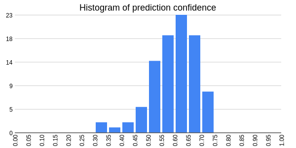

# histogram-chart.ts

Generate histogram chart in browser, node.js, and cli.

[](https://www.npmjs.com/package/histogram-chart.ts)
[](https://bundlephobia.com/package/histogram-chart.ts)
[](https://bundlephobia.com/package/histogram-chart.ts)



## Features

- Default styling
- Auto determine bin (allow customization)
- Support values in any range, e.g. 0 to 1, -1 to 1, -20 to 200, etc.
- Typescript support
- Isomorphic package: works in Node.js and browsers

## Installation

```bash
npm install histogram-chart.ts
```

You can also install `histogram-chart.ts` with [pnpm](https://pnpm.io/), [yarn](https://yarnpkg.com/), or [slnpm](https://github.com/beenotung/slnpm)

## Usage Example

### Node.js

```typescript
import { node_plot } from 'histogram-chart.ts/node'

node_plot({
  width: 600,
  height: 300,
  data: [1, 2, 3, 4, 5],
  title: 'Histogram',
  file: 'histogram.png',
})
```

### Browser

```typescript
import { browser_plot } from 'histogram-chart.ts/browser'

browser_plot({
  width: 600,
  height: 300,
  data: [1, 2, 3, 4, 5],
  title: 'Histogram',
})
```

### CLI

```bash
> npm i -g histogram-chart.ts
> histogram-chart --help
histogram-chart

Usage: histogram-chart [options] <data_file> <image_file>

Options:
  --title=<title>  Title of the chart, default: "Histogram"
  --width=<width>  Width of the chart, default: 600
  --height=<height>  Height of the chart, default: 300
  --min-value=<min_value>  Minimum value of the chart, default: min value of data
  --max-value=<max_value>  Maximum value of the chart, default: max value of data
  --bucket-count=<bucket_count>  Number of buckets, default: sqrt(data.length)
  <data_file>  File containing the data, can be txt, csv, tsv
  <image_file>  File to save the image, can be png, jpg

Remark:
  The data file and image file can be given in any order.

Examples:
  histogram-chart log.txt chart.png
  histogram-chart --title="Histogram of Request Latency" log.txt chart.png
```

## Typescript Signature

### For Node.js

```typescript
// way to import
import { node_plot } from 'histogram-chart.ts/node'

// exported function
export function node_plot(options: {
  /** .png, .svg, or .pdf */
  file: string
  /** e.g. 600 */
  width: number
  /** e.g. 300 */
  height: number
  data: number[]
  title: string
  /** default: `Math.min(...data)` */
  min_value?: number
  /** default: `Math.max(...data)` */
  max_value?: number
  /** default: `Math.sqrt(data.length)` */
  bucket_count?: number
}): void
```

### For Browser

```typescript
// way to import
import { browser_plot } from 'histogram-chart.ts/browser'

// exported type
export type BrowserPlotOptions = {
  /** e.g. 600 */
  width: number
  /** e.g. 300 */
  height: number
  data: number[]
  title: string
  /** default: `image/png` */
  mimeType?: 'image/png' | 'image/jpeg' | 'image/webp'
  /** compression quality for jpeg and webp */
  quality?: number
  /** default: `Math.min(...data)` */
  min_value?: number
  /** default: `Math.max(...data)` */
  max_value?: number
  /** default: `Math.sqrt(data.length)` */
  bucket_count?: number
}

export function browser_plot(
  options: BrowserPlotOptions & {
    as?: 'dataUrl'
  },
): string
export function browser_plot(
  options: BrowserPlotOptions & {
    as: 'blob'
  },
): Promise<Blob>
```

## License

This project is licensed with [BSD-2-Clause](./LICENSE)

This is free, libre, and open-source software. It comes down to four essential freedoms [[ref]](https://seirdy.one/2021/01/27/whatsapp-and-the-domestication-of-users.html#fnref:2):

- The freedom to run the program as you wish, for any purpose
- The freedom to study how the program works, and change it so it does your computing as you wish
- The freedom to redistribute copies so you can help others
- The freedom to distribute copies of your modified versions to others
